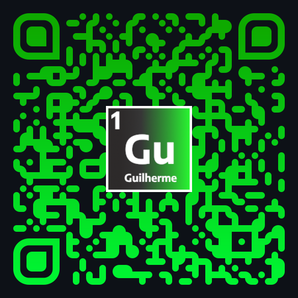
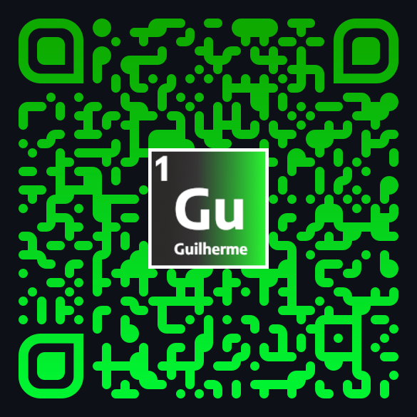

# PeriodicNator

## Descrição

PeriodicNator é um jogo educacional interativo que testa seus conhecimentos sobre elementos químicos. O jogador deve identificar o nome dos elementos a partir de seus símbolos e dicas fornecidas, em diferentes níveis de dificuldade. O jogo é uma maneira divertida de aprender química e expandir seus conhecimentos sobre a tabela periódica.

## Tecnologias Utilizadas

- **HTML**
- **CSS**
- **JavaScript**

## Funcionalidades

- Escolha entre três níveis de dificuldade:
  - **Fácil**: 20 elementos, perguntas em ordem.
  - **Médio**: 40 elementos, perguntas aleatórias.
  - **Difícil**: Todos os elementos, perguntas aleatórias.
- Sistema de pontuação que conta quantas perguntas foram respondidas corretamente.
- Interface amigável com feedback instantâneo sobre as respostas.

## Como Jogar

1. **Escolha a Fase**: Na tela inicial, selecione um dos níveis de dificuldade (Fácil, Médio ou Difícil).
2. **Responda às Perguntas**: Você verá a pergunta com o símbolo do elemento e uma dica. Digite o nome do elemento no campo de resposta.
3. **Receba Feedback**: Após enviar sua resposta, você receberá uma mensagem informando se a resposta está correta ou incorreta.
4. **Finalize o Jogo**: Ao responder todas as perguntas, você verá sua pontuação final e terá a opção de jogar novamente.

## Acesse o Jogo

Você pode jogar o Desafie a Tabela Periódica clicando no seguinte link: [Desafie a Tabela Periódica]([https://seu-link-do-site.com](https://guilhermemorettodeitos.github.io/Jogo-TP/))

### Acesso via QR Code

Você também pode acessar o jogo escaneando o QR Code abaixo:

### Acesso à Tabela Pediódica via QR Code

Você também pode acessar a Tabela Periódica escaneando o QR Code abaixo:

## Licença

Este projeto está licenciado sob a [GNU General Public License](LICENSE).

